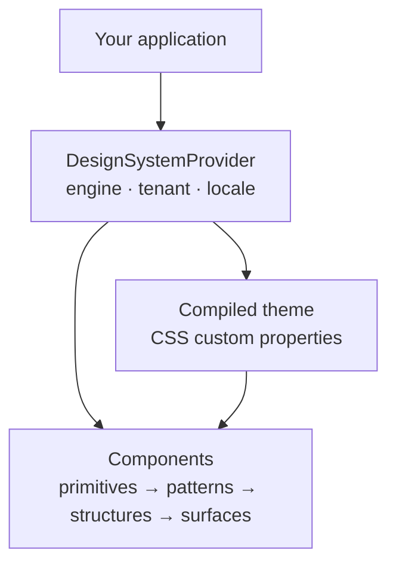

# @rottay/design-system

A multi-engine, multi-tenant React design system. One component API renders through
three interchangeable presentation engines, and a tenant's entire visual identity is a
compiled artifact rather than a fork: brand, palette, shape, density and motion are data
that the build lowers into CSS custom properties, so re-theming a product never means
editing a component.

- **Engine-switched components.** Every primitive ships `classic`, `modern` and `rustic`
  implementations selected at runtime; a `custom` pack registry lets a tenant substitute
  its own components without a fork.
- **White-label by compilation.** A theme is lowered once, server-side, into the exact
  CSS artifact the page embeds — not assembled in the browser.
- **Enforced boundaries.** Icon suppliers, raw HTML, hardcoded colors and database access
  in components are blocked by shipped ESLint rules, not by convention.

## What using it looks like

```tsx
import { DesignSystemProvider, Button, Card, Stack, Text } from '@rottay/design-system';
import '@rottay/design-system/styles.css';

export function App() {
  return (
    <DesignSystemProvider forceEngine="modern" tenantSlug="acme" locale="en">
      <Card>
        <Stack gap="4">
          <Text as="h1">Quarterly report</Text>
          <Button variant="primary" onClick={() => console.log('exported')}>
            Export
          </Button>
        </Stack>
      </Card>
    </DesignSystemProvider>
  );
}
```



## Install

The package is distributed through a private registry under the `@rottay` scope and
requires authentication. See [docs/getting-started.md](docs/getting-started.md) for
registry setup, peer dependencies and the required stylesheet import.

## Repository layout

```text
packages/core/        The publishable library: components, tokens, engines, contracts
packages/showroom/    Reference application and visual gallery for the library
docs/                 Documentation set for consumers and contributors
scripts/              Workspace-level checks and maintenance commands
.changeset/           Release intents; version bumps and changelog entries
```

## Capabilities at a glance

| Area | What ships |
|---|---|
| Engines | `classic` (Ant Design), `modern` (token skins), `rustic` (vanilla CSS), `custom` (pack registry) |
| Component tiers | primitives, patterns, structures, surfaces |
| Icons | **282** governed semantic roles behind a supplier-independent `Icon` facade |
| Charts | 18 D3-backed chart families, token-aware and accessible |
| Lint rules | **6** rules: `no-raw-html`, `no-hardcoded-colors`, `no-db-in-components`, `no-direct-lucide`, `no-motion-literals`, `no-size-type-outside-classic` |

## Documentation

Start at the hub: **[docs/README.md](docs/README.md)**.

| Document | Answers |
|---|---|
| [Getting started](docs/getting-started.md) | How do I install it and render something? |
| [Architecture](docs/architecture/index.md) | How is it built, and how does an engine resolve? |
| [Public API](docs/api.md) | What may I import, and what is stable? |
| [Customization](docs/customization.md) | How do I make it look like my product? |
| [Testing and gates](docs/testing.md) | What is verified, and what can I run? |

Contributors should also read [ownership](docs/ownership.md) — which files are authored
and which are generated — and [releasing](docs/releasing.md).

## Contributing

See [CONTRIBUTING.md](CONTRIBUTING.md) for setup, conventions and the review contract.

## License

Released under the [MIT License](LICENSE). Note the distinction: the **source is open**,
while **package publication stays private and controlled** — releases go to a restricted
registry under the `@rottay` scope, and there is no public npm distribution. See
[docs/releasing.md](docs/releasing.md).

## Security

Report vulnerabilities privately as described in [SECURITY.md](SECURITY.md).
