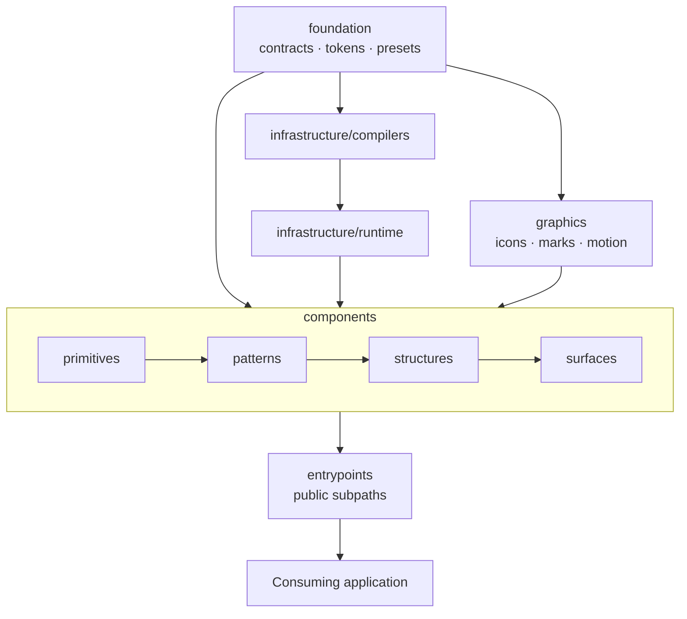
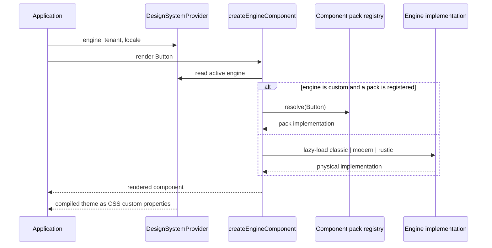

# Architecture

The normative reference for how this repository is organized: what each owner is for, how
the parts depend on each other, and which rules a change must satisfy. It is the law the
tree is held to, not a snapshot of what happens to be on disk.

For the import surface see [api.md](../api.md); for changing appearance see
[customization.md](../customization.md); for what you may edit by hand see
[ownership.md](../ownership.md).

Counts appear here only where a gate or manifest enforces them. Prose counts rot;
mechanical counts do not.

## 1. Design goals

1. **One API, several presentations.** An application imports `Button` once. Which
   implementation renders is a runtime decision, not an import-time one.
2. **Appearance is data, not code.** A tenant's identity compiles into an artifact. No
   product forks a component to change a color.
3. **Boundaries are executable.** Ownership, dependency direction and supplier isolation
   are enforced by checks that fail, not by review habit.
4. **Capability is shared; form is specialized.** Reusable behavior converges into the
   library; narrative, layout rhythm and domain vocabulary stay in the consuming
   application.

## 2. Package layout

| Package | Role | Published |
|---|---|---|
| `packages/core` | The library: components, tokens, engines, contracts, generators | Yes |
| `packages/showroom` | Reference application and visual gallery | No |

The repository root holds only toolchain manifests the tools require there, the entry
documents, and first-level folders whose names say what they contain. Nothing else.

`packages/core` has seven source-controlled roots — `src/`, `scripts/`, `tests/`,
`contracts/`, `governance/`, `artifacts/` and `docs/`. `dist/` is disposable build
output, never an authority. `governance/` holds the capability manifest and the
vendored-supplier records; `artifacts/` holds committed quality evidence and generated
reports. Which files in them may be edited by hand is settled in
[ownership.md](../ownership.md).

## 3. Source ownership

`packages/core/src` is a dependency and ownership tree, not a flat catalog. D-21
(b) (owner, 2026-09-05) fixes the target first level; the two legacy aggregate
roots stay declared while they still hold the unmigrated tree, and WO-RET-04
normalizes them:

```text
src/
  contracts/        Typed contracts, born under the target grammar (WO-CAT-02)
  kernel/           Reserved by D-21 (b); not materialized yet
  tokens/           Reserved by D-21 (b); not materialized yet
  compilers/        Reserved by D-21 (b); not materialized yet
  runtime/          Reserved by D-21 (b); not materialized yet
  graphics/         Icons, brand marks, pictograms and motion
  components/       The four UI tiers
  entrypoints/      Classified package-subpath boundaries
  index.ts          Package-root facade; the only loose file at the source root

  foundation/       LEGACY aggregate: contracts, kernels, presets, i18n, tokens
  infrastructure/   LEGACY aggregate: compilers and runtime orchestration
```

The admitted set is declared by name in `ARCHITECTURE_TIERS` /
`CLASSIFIED_SUPPORT_ROOTS` of
`packages/core/scripts/check/architecture/audits/structure/index.mjs`. A root
outside it fails `structure:check` instead of widening the identity baseline.

At the macro level, dependencies flow toward the product edge:

```text
foundation -> contracts -> infrastructure/compilers -> infrastructure/runtime
foundation + contracts + infrastructure + graphics -> components
primitives -> patterns -> structures -> surfaces -> consuming app
```

`contracts/` ranks ABOVE `foundation/` and not below it, and the rank is the
measured direction rather than the target one: `contracts/theme` still consumes
the vocabularies parked in `foundation/contracts/**`. The compensating law is
that nothing under `foundation/` may import `contracts/`, which that same rank
makes a red inversion rather than a convention.

Within a single capability, lower branches precede higher ones:

```text
foundation | kernel | contracts | policy | quality | spec | validation
  -> runtime
  -> composition | react
  -> presentation
  -> facade | public
```

A dependent owner never sits beside its dependency as an architectural peer.

## 4. The folder/index law

**Everything is `folder/index`, everywhere** — not only `src/`, but scripts, docs and
data too. A loose file tells a reader nothing; a named chain of folders says what the
thing is before the file is opened. The path is the documentation.

- Authored units are `folder/index.ts[x]` (source), `folder/index.mjs` (scripts), or a
  folder holding exactly one self-evident artifact (data, docs).
- **No loose authored files at any root** — not the repository root, a package root, the
  scripts root, or a group directory. The only exception is toolchain files a tool
  resolves by convention (`package.json`, `tsconfig.json`, `*.config.ts`, `.gitignore`)
  plus ambient declarations those configs name, and they stay where the tool requires.
- `packages/core/src/index.ts` is the only loose file at the source root.
- Two or more related units gain a named family directory, and a family name never
  repeats inside its children: `tokens/channel-parity/`, not
  `tokens/tokens-channel-parity/`.
- A barrel may aggregate child owners, but it does not share its level with loose
  authored peers.
- Unit tests live inside the owning unit's folder. A suite whose subject spans owners
  lives with the family that owns the *subject*, not with one of its inputs.
- A gate's baselines, allowlists and recorded evidence live **inside that gate's own
  folder**, never loose in a shared root.
- Generated files, declarations, fixtures, examples, stories and registered package
  entrypoints are classified exceptions — not a precedent for product code.
- Generic ownership segments (`_internal`, `internal`, `misc`, `shared`, `utils`,
  `hooks`) are forbidden. Name the capability instead.
- Physical moves preserve public exports and package subpaths; private compatibility
  shims are not left behind to keep old internal paths alive.
- **A label does not retire anything.** `@deprecated`, "canonical", "historical" and
  "legacy" in a docstring are debt dressed as a decision unless a command fails while the
  declared-dead artifact is still reachable. Every such declaration carries a removal step
  or a mechanical check.

The executable form:

```bash
pnpm --filter @rottay/design-system structure:check
```

Its baseline is decrease-only. A new finding is fixed, never absorbed to make the gate
pass.

## 5. The four tiers

`components/` has one dependency direction: each tier may use the tiers below it, never
those above.

| Tier | Answers | Examples |
|---|---|---|
| `primitives/` | What is the smallest engine-switched element? | Button, Input, Card, Modal |
| `patterns/` | What solves a repeatable task? | data table, form builder, kanban board |
| `structures/` | What frames a page around a task widget? | headers, toolbars, record panels |
| `surfaces/` | What describes a whole screen declaratively? | list, dashboard, form recipes |

| If the piece... | it belongs in... |
|---|---|
| Is a leaf component with an engine switch | primitives |
| Solves a generic reusable task | patterns |
| Wraps or accompanies a pattern as page chrome | structures |
| Describes a whole page as a config object | surfaces |
| Depends on a business domain, route, API or copy | **the consuming application** |

Each tier also carries classified support owners — `foundation/`, `runtime/`,
`presentation/`, `facade/` and `tests/` — holding shared contracts, headless kernels and
contract tests. They are not component families.

**One capability, one owner.** Where the same job exists twice, one is canonical and the
other is retired or migrated; two owners for one capability is a defect, not a choice. A
pattern sharing a name with a primitive must compose that primitive rather than
reimplement it.

If a piece needs to know what a customer, invoice or booking *is*, it belongs to the
application that owns that vocabulary.

## 6. Dependency direction



## 7. The engine model

Three physical engines, plus one registry identity:

| Engine | Implementation | Use |
|---|---|---|
| `modern` | Native token and skin presentation | The product engine; new capability lands here first |
| `classic` | Ant Design-backed | Enterprise compatibility |
| `rustic` | Vanilla React and CSS | Lightweight fallback |
| `custom` | Registered component pack | White-label substitution; falls back to a configured physical engine |

`custom` is a pack-scoped registry identity, **not** a fourth implementation copied into
every component. It renders a registered component when one exists and otherwise
delegates.

An engine-backed component keeps a stable facade at the owner and adds only the branches
it needs:

```text
button/
  index.tsx                            Facade and props contract
  contracts/index.ts
  runtime/<capability>/index.ts
  engines/{classic,modern,rustic}/index.tsx
  tests/*.test.tsx
```

## 8. Runtime resolution



The provider supplies tenant, locale, feature and motion context. It does not query a
database, and in compiled-artifact mode it emits no competing visual layer.

## 9. Code splitting

Each engine-backed component registers up to three dynamic loaders and lazy-loads only
the active engine, so an application on `modern` does not pay for `classic`. Stylesheets
split the same way: a default bundle plus focused subpaths for per-engine and
per-vertical CSS, so a consumer ships one presentation rather than all of them. Fonts are
separate opt-in subpaths for the same reason.

## 10. Public boundaries

**The package root barrel is the primary public way.** Applications import components,
hooks, contracts and runtime API from `@rottay/design-system`. The root barrel carries an
explicit API list — an owner exporting a symbol does not mean the package publishes it.

Classified subpaths expose cross-cutting capability boundaries, each backed by an owner
under `src/entrypoints/`: server-safe tenant resolution, CSS bundles, governed icon packs,
brand and cloud marks, pictograms, the chart kernel, motion/effect/spatial contracts, the
governance ESLint plugin, and opt-in font packs. The current list is enumerated in
[api.md](../api.md) rather than restated here.

Three standing rules:

- **Granular per-tier subpaths are retired.** `./primitives/*`, `./patterns/*`,
  `./structures/*` and `./surfaces/*` are not the way; capability boundaries are.
- **There is no `./commercial` subpath.** "Commercial" is a marketing adjective, not an
  architectural role. A capability behind such a name is reclassified by what it does.
- **Every declared `exports` target must exist as a build artifact.** The boundary is
  honest or the build fails; it is never pointed at files the build does not produce.

Deep imports into `src/` or `dist/` internals are not an API and carry no stability
guarantee.

## 11. Tenant and visual authority

Two authority classes. Code-owned vertical baselines are static-first: their TypeScript
theme sources compile into generated CSS artifacts, and the baselines are mirror themes —
identical channel surface, identical names, different values. Published customer tenants
are stored-document-owned, and a hostname chooses tenant identity, never a checked-in CSS
file or a component branch.

`Theme` is the single theme contract. Both transports resolve to the same complete theme
and enter **one lowering** under
`src/infrastructure/compilers/runtime/theme/runtime/lowering/`, which owns the whole
`resolveTheme -> compileTheme -> EngineAdapter.project` chain and delegates emission to
`emitThemeCss`. There is deliberately no second compiler, and the structural gate
`tests/architecture/theme-lowering-single-door/` fails if one reappears.

The canonical custom-property prefix is `--ds-`. Component-local private variables use
`--_ds-*` and are internal wiring, never a customization surface. The `--ds_` prefix is
free experimentation space and must never reach a published artifact.

The full model — merge chain, token layers, what a tenant may and may not change — is in
[customization.md](../customization.md).

## 12. Script and gate governance

- `packages/core/scripts/` has exactly six action-first roots: `build/`, `check/`,
  `generate/`, `libraries/`, `maintain/` and `package/`. These are exhaustive;
  source-layer names are not alternative script destinations.
- Every script is an `<intent>/<subdomain?>/<capability>/index.mjs` owner with its tests
  and baselines inside its own folder. The root says what the command does; the rest of
  the path says to what and how — `check/tokens/cascade/probe/` reads as one sentence.
- Under `check/`, the subdomain names the class of thing being proved: among others
  `architecture/`, `automation/`, `boundaries/`, `docs/`, `engine/`, `evidence/`,
  `localization/`, `orchestration/`, `taxonomy/`, `tokens/`, `touch-targets/` and
  `verticals/`. `evidence/` splits into `certification/`, which owns what a claim must
  prove, and `framework/`, which owns the machinery that proves it.
- `check/modern-rescue/` is a bounded programme zone rather than a general subdomain. It
  carries its own README, and that README — not this document — is the authority for
  everything inside it.
- `libraries/` holds the shared resolvers the gates depend on, so that a rule is written
  once and every caller inherits it. `libraries/taxonomy/owner-resolution/` is the
  representative case: it maps each inventory row onto a real directory, case-exact, and
  refuses to resolve rather than returning the empty answer that would read as a clean
  tree.
- **Every gate is wired or it does not exist.** A check nobody runs is not a check.
  Equally, every test must be reachable by a runner glob.
- Codemods are single-use and declare their expiry; one whose target path no longer exists
  is deleted on sight.
- **A document describing something that no longer exists is corrected or removed** — the
  rule this document is itself held to.

Which gates exist, what each proves, and which can be run outside the organization are
documented in [testing.md](../testing.md).

## 13. Non-goals

- **No product semantics.** The library does not know what a customer, invoice, booking or
  campaign is, and never will.
- **No domain components.** A widget requiring domain vocabulary belongs to the
  application that owns it.
- **No second compiler.** Every theme transport enters a single lowering; a parallel path
  would be a second source of truth.
- **No visual authority in the browser.** Production styling is compiled server-side and
  embedded; the client hydrates that exact artifact.

## 14. Provenance

This document supersedes the former root `ARCHITECTURE.md` and, before it, a package-level
architecture document. It carries forward the durable law from those texts. Two classes of
content were deliberately left behind rather than relocated: a per-owner enumeration of the
target tree, and a delta between that target and the tree at a moment in time. Both were
migration bookkeeping with a short half-life, and neither is architecture a consumer or
contributor needs. Where those texts stated a rule rather than an inventory, the rule is
above.
