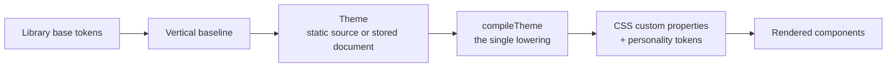

# Customization

How to make the library look like your product. For what you may import see
[api.md](api.md); for how the pieces fit together see [architecture](architecture/index.md).

## The model in one line

**Capability is shared; form is specialized.** Behavior converges into the library so
every product gets the same table, the same overlay semantics and the same focus
handling. Appearance diverges by data, so two products built on the same components do
not have to look alike.

The practical consequence: **nobody edits a component to change how it looks.** Inside a
component the responsibilities are split three ways.

| Layer | Owns | Who changes it |
|---|---|---|
| Component TSX | Structure and interaction state — the parts, states and variants it stamps | The library |
| Skin CSS | All paint and geometry, read through token channels | The library |
| Tokens | The values those channels resolve to | **You** |

Re-theming is an artifact swap, not a code change.

## The merge chain



Two transports, one contract, one compiler. A theme authored in TypeScript and a theme
stored for a published tenant both resolve to the same complete `Theme` and enter the
same lowering under `src/infrastructure/compilers/kernel/runtime/brand-theme/`. There is
deliberately no second compiler: a parallel path would be a second source of truth.

A partial patch exists only at ingestion. It never reaches the compiler — the compiler
sees a complete theme or it sees nothing.

## Token layers

Three prefixes, three different contracts. Only one of them is yours.

| Prefix | Meaning | Stable for consumers |
|---|---|---|
| `--ds-*` | The public custom-property surface: roots and component channels | Yes |
| `--_ds-*` | Component-local private wiring | No — internal, may change without notice |
| `--ds_*` | Free experimentation space | Never ships; must not appear in a published artifact |

Component channels resolve through a chained fallback to a small set of named roots:

```css
background: var(--ds-button-primary-bg, var(--ds-color-primary));
```

That chain is the reason a single root decision reaches every component that has not
overridden it. Set the root, and the components follow; override one channel, and only
that channel moves.

## Theming a tenant

A tenant supplies identity and a bounded set of values:

```ts
const branding = {
  companyName: 'Acme',
  logo: '/brand/acme.svg',
  logoMark: '/brand/acme-mark.svg',
  favicon: '/brand/favicon.ico',
  primaryColor: '#2f5bea',
  secondaryColor: '#0e1b3c',
  accentColor: '#ff8a3d',
  darkPrimaryColor: '#7f9cff',
  darkBackgroundColor: '#0b0f1a',
  successColor: '#1f9d55',
  warningColor: '#c77700',
  errorColor: '#c0392b',
};
```

Beyond brand colors, a theme can move bounded chrome sections — controls, table, card,
modal, tabs, sidebar, layout — plus density, shape, typography and motion dials, and a
capped set of raw `--ds-*` overrides for cases the dials do not cover.

The complete, current list of governed controls is generated from source rather than
restated here:

```bash
node packages/core/scripts/generate/tokens/customization/controls/index.mjs --write
```

The output lives at `packages/core/docs/generated/customization-controls/index.md`.

## Compiled artifacts

Production styling is **compiled on the server and embedded for SSR**. The client
hydrates that exact artifact with `visualAuthority="compiled-artifact"`; in that mode the
provider deliberately emits no competing visual layer, and browser components never query
a database.

The alternative mode, `visualAuthority="provider"`, has the provider emit variables
inline. It is the preview, development and compatibility path — useful for a live theme
editor, not the productive customer path.

First-party stylesheets under `foundation/tokens/css/.../artifacts/` are **generated
snapshots**. The TypeScript theme sources are the truth; the CSS is output. Editing the
CSS by hand is a change that the next build silently discards — see
[ownership.md](ownership.md).

## What a tenant may and may not change

| May change | May not change |
|---|---|
| Company name, logo, logo mark, favicon | Which engine renders |
| Brand, semantic and dark-mode colors | The vertical identity of the product |
| Density, shape, typography and motion dials | Component structure, anatomy or behavior |
| Bounded chrome sections | Icon supplier, glyph meaning or role mapping |
| A capped set of raw `--ds-*` overrides | Chart renderer or data semantics |
| Locale and bounded translations | Skin internals and `--_ds-*` wiring |

The asymmetry is deliberate. Everything on the left is presentation a customer legitimately
owns. Everything on the right is either a correctness guarantee or a promise the library
makes to every other consumer, and a tenant that could move it could break it.

## Dark mode

Dark mode is a theme state, not a second theme. Components read the same channels; the
resolved values change. The root carries an explicit `data-theme="dark"` when a choice has
been made, and falls back to `prefers-color-scheme` when it has not — so a page respects
the operating system until a viewer overrides it.

Dark values are authored alongside light ones (`darkPrimaryColor`, `darkBackgroundColor`
and their siblings) rather than derived, because automatic darkening produces muddy brand
colors and unreadable accents.

## Accessibility floors

Contrast floors win over any profile. An expressive theme may push tone, spacing and
motion, but it cannot push a foreground and background into an unreadable pair: the
floors clamp the result, and a contract test asserts they hold.

Two consequences worth knowing before you author a theme:

- A brand color that fails contrast will be adjusted at compile time rather than shipped
  as authored. Check the compiled result, not the input.
- Contrast can be validated ahead of publishing through the server entry point, which
  exports `validateBrandingContrast` for exactly this purpose.

Motion follows the same principle: a theme may set motion personality, and a viewer's
reduced-motion preference still wins.
