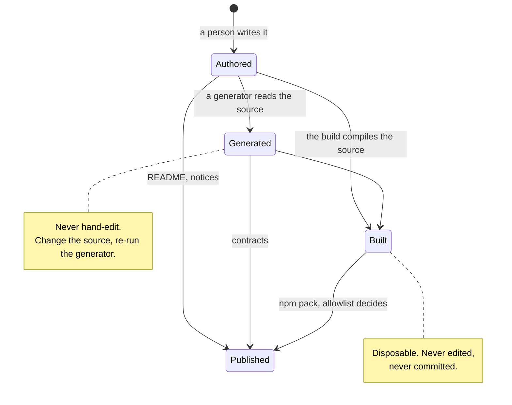

# File ownership

Which files you may edit by hand, and which ones will silently discard your edit. This is
the single most common way a first contribution is lost: the change was correct, but it
was made in an output rather than in its source.

## Four kinds of file



| Kind | Where it lives | Edit by hand? |
|---|---|---|
| **Authored** | `src/`, `scripts/`, `tests/`, `docs/`, `governance/`, most of `contracts/` | Yes — this is the work |
| **Generated** | Outputs listed below, each with a generator | **No** — edit the source and regenerate |
| **Built** | `dist/` | **No** — disposable output, not committed |
| **Published** | Whatever the npm allowlist selects | Not directly — it is a selection, not a place |

## Authored roots

`packages/core` has seven source-controlled roots. `dist/` is not among them.

| Root | Owns |
|---|---|
| `src/` | The library itself: components, tokens, engines, contracts, entry points |
| `scripts/` | Build, check, generate, maintenance and packaging commands |
| `tests/` | Cross-unit integration, system and architecture suites |
| `contracts/` | Machine-readable contracts published alongside the package |
| `governance/` | The capability manifest, vendored-supplier license records, token decisions |
| `artifacts/` | Committed quality evidence and generated reports |
| `docs/` | Package-level documentation |

Unit tests live inside the unit they cover. Cross-unit suites live under `tests/`. Every
authored unit is a `folder/index.ts(x)` owner rather than a loose file — see
[architecture](architecture/index.md).

Two of those roots carry named sub-owners worth knowing before you go looking:

| Sub-owner | Holds |
|---|---|
| `governance/manifest/` | The capability manifest: `families/<layer>/<group>/<slug>/`, `controls/<group>/<control>/`, plus `cascade/`, `recipes/` and `schema/` |
| `governance/graphics/`, `governance/effects/` | License records and provenance for vendored suppliers |
| `governance/tokens/` | Token decisions and prototypes |
| `artifacts/quality/` | Committed quality evidence: audits, certification records, programme reports |
| `artifacts/generated/` | Reports and CSS written by the checks and generators that own them |
| `artifacts/local/` | Developer previews — convenience output, never authority |

One evidence tree still sits outside the package roots: the repository-root
`test-artifacts/` holds craft evidence and is live, read by a blocking packaging gate.
Folding it into the package is outstanding repository hygiene; until that happens it is
tracked evidence rather than scratch space, and deleting from it breaks a gate.

## Generated files and their generators

Each of these is an output. Editing one works locally and disappears on the next run.

| Output | Regenerate with |
|---|---|
| `docs/generated/component-taxonomy/` | `pnpm --filter @rottay/design-system docs:taxonomy` |
| `docs/generated/customization-controls/` | `node packages/core/scripts/generate/tokens/customization/controls/index.mjs --write` |
| `src/graphics/icons/semantic/generated/` | `pnpm --filter @rottay/design-system icons:generate` |
| `src/foundation/tokens/css/facade/artifacts/` | `pnpm --filter @rottay/design-system build:vertical-css` |
| `dist/modern-engine.css` | `pnpm --filter @rottay/design-system build:modern-css` |
| `governance/manifest/index.json` | `node packages/core/scripts/generate/tokens/manifest/generation/index.mjs --write` |
| `artifacts/generated/` | Written by the checks and generators that own each report |

The capability manifest is a mixed tree, so read the row above precisely: its `families/`,
`controls/`, `cascade/`, `recipes/` and `schema/` leaves are authored governance records,
while `governance/manifest/index.json` is the generated rollup carrying the denominators
and the inputs digest. Edit a leaf, then regenerate the rollup; a blocking gate fails when
the two disagree. Its counts are derived rather than original: the rollup restates
denominators the customization programme owns upstream. Read a count from the artifact
that owns it — quoting one into prose is how a count starts rotting.

Several of these have a `--check` mode that regenerates into a temporary location and
compares byte for byte, so a stale output fails CI instead of drifting quietly. The icon
corpus is the clearest example:

```bash
pnpm --filter @rottay/design-system icons:check
```

Adding an icon therefore means editing the corpus manifest under
`src/graphics/icons/semantic/sources/corpus/`, then regenerating — never editing a file
under `generated/`.

## The banner rule

Every generated file declares itself in its first lines, naming the generator and the
command that reproduces it:

```
<!-- THIS FILE IS AUTO-GENERATED by scripts/generate/taxonomy/index.mjs -->
<!-- Run `pnpm docs:taxonomy` to regenerate. Do not edit by hand. -->
```

If you open a file and see that header, stop and find the source. If you write a
generator, emit that header — a generated file that does not announce itself is a trap
for the next contributor.

## `dist/` is disposable

`dist/` is build output. It is not committed, not an authority, and never edited. Two
consequences worth internalizing:

- **A stale `dist/` is a release blocker, not a nuisance.** `distfresh:check` compares the
  built output against the current source and fails when they disagree.
- **Debugging in `dist/` proves nothing.** A fix applied there vanishes on the next build;
  it belongs in `src/`.

## What actually gets published

Publication is an **allowlist**, not "everything not ignored" — the package manifest names
the files that ship, and a committed baseline pins that list and its size. The contents
and the ratchet are documented in [releasing.md](releasing.md), which owns that subject.

The rule to carry: a file existing in the repository says nothing about whether it
reaches a consumer. If you need something to ship, it must be added to the allowlist
deliberately, and that addition is reviewed.

## Vendored suppliers and notices

Some third-party code and artwork is embedded rather than merely depended on, which
carries obligations:

- `THIRD_PARTY_NOTICES.md` records the embedded suppliers and their licenses, and it
  ships with the package.
- `governance/graphics/` holds license records and provenance for vendored graphics, and
  ships alongside the notices.
- `governance/effects/` records the same provenance for vendored effect sources. It is
  authored governance rather than published material: the allowlist ships the graphics
  records, not these.
- A gate verifies those license records are present and intact before packing; another
  bounds how much vendored supplier code the bundle may embed.

Adding or upgrading a vendored supplier means updating the notices and the license
records in the same change. A supplier whose provenance is not recorded is not shippable,
and the gate will say so rather than letting it through.
