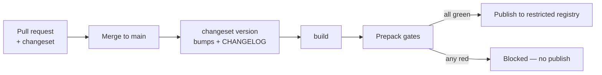

# Releasing

How a change becomes a version, and what the published artifact contains. For which files
you may edit before that point, see [ownership.md](ownership.md).

## Distribution

The distinction matters and is deliberate:

- **The source is open.** The repository is released under the
  [MIT License](../LICENSE).
- **Publication is private and controlled.** Releases go to a restricted registry under
  the `@rottay` scope (`npm.pkg.github.com`), and installing requires authentication.
  `publishConfig.access` is `restricted`, and the changeset configuration carries the
  same `restricted` access.

There is no public npm distribution. Reading, forking and building the source does not
grant access to published artifacts, and nothing in this repository should be read as
promising a public package. Registry setup for authorized consumers is documented in
[getting-started.md](getting-started.md).

## Versioning policy

The package follows semantic versioning, and the contract is the **declared subpath
surface** — the root barrel plus the classified subpaths listed in [api.md](api.md).

| Change | Bump |
|---|---|
| A new component, subpath, prop or token channel | minor |
| A bug fix that keeps the rendered contract | patch |
| Removing or renaming a public export or subpath | major |
| Changing a component's default rendered output | major |
| Changing internals reachable only by a deep import | not covered — see below |

**Deep imports carry no guarantee.** A path into `src/` or `dist/` internals is not part
of the versioned surface, and it can change in a patch. If you need something that is only
reachable that way, ask for it to be exposed rather than importing around the boundary.

## Changesets

Every change that affects the published package needs a changeset. It is how the version
bump and the changelog entry are produced, and CI rejects core changes that arrive
without one.

```bash
pnpm changeset            # describe the change and choose the bump
pnpm changeset:version    # apply bumps and write CHANGELOG entries
pnpm changeset:publish    # publish to the restricted registry
```

Write the changeset for someone upgrading, not for the reviewer: name the symbol or
subpath affected and what a consumer must do differently, if anything. Documentation-only
and tooling-only changes do not need one.

## Release flow



Publication is gated, not merely scripted. `prepack` runs before any pack or publish and
fails the release rather than shipping a stale or dishonest artifact:

```
public-entrypoints:check      the declared subpaths match reality
distfresh:check               dist/ was built from the current source
exports:artifact:check        the exports map matches what was built
runtime-hardening:structural  runtime guards are intact
graphics-licenses:check       vendored graphics carry their licenses
public-declarations:check     type declarations resolve for every entry
```

`distfresh:check` is the one that most often stops a release, and it is doing its job: it
means the working tree changed after the last build, so `dist/` no longer describes the
source.

## What ships

The published tarball is an allowlist, not "everything not ignored". It carries:

- built bundles (`dist/**/*.js`, `*.cjs`, `*.d.ts`) with declaration maps excluded;
- the default stylesheet, per-engine and per-vertical CSS, and the font stylesheets;
- the JSON and declaration **contracts** under `contracts/` — the supplier contract, the
  CSS hooks manifest, the public entrypoints manifest and the theme canary fixtures;
- `THIRD_PARTY_NOTICES.md` and the graphics license records under `governance/graphics/`;
- `README.md`.

Everything else — sources, tests, scripts, documentation, fixtures — stays out.

**The pack is ratcheted.** A committed baseline pins the shipped file list and the
unpacked size; additions require explicit review, and size is decrease-only. Two further
gates run against the same artifact: a content scan that refuses fixtures and supplier
taint in shipped paths, and a ceiling on how much vendored supplier code the bundle may
embed. The intent is that growth in what ships is always a decision somebody made, never
a side effect.

```bash
pnpm --filter @rottay/design-system packinv:check    # file list + size ratchet
pnpm --filter @rottay/design-system iconembed:check  # vendored supplier ceiling
```

## Supported versions

Support tracks the current minor line: fixes land on the latest release, and there are no
long-term maintenance branches for older minors. An authorized consumer needing a fix on
an older line should open an issue describing the constraint rather than assuming a
backport.

The current line is recorded in `packages/core/package.json` and the release history in
`packages/core/CHANGELOG.md`. Both are generated or updated by the release flow above;
neither is restated here, so neither can go stale in this document.

## Deprecation policy

A deprecation is a dated promise with a mechanism behind it, not a docstring:

1. **Announce.** The symbol is marked deprecated in its own declaration and in the
   changeset, naming the replacement.
2. **Overlap.** The old and new surfaces both work for at least one minor release, so an
   upgrade is never forced inside a patch.
3. **Remove.** Removal happens in a major, and only when nothing in the repository still
   reaches the deprecated path.

The rule that keeps this honest: a label does not retire anything. `@deprecated`,
"legacy" and "compatibility only" are debt dressed as a decision unless a command fails
when the declared-dead artifact is still reachable. Every deprecation carries either a
removal step or a check that enforces it.
